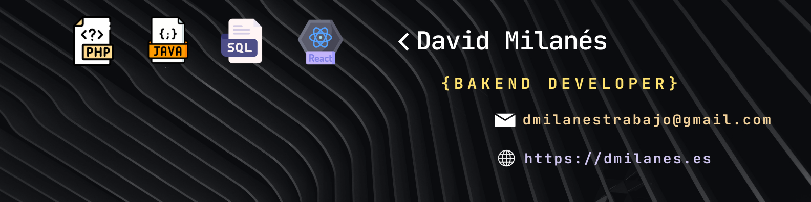

# ¡Hola, bienvenido a mi github! 👋

Soy un Desarrollador de Software con más de 2 años de experiencia en PHP, MySQL, Java, Desarrollo Web, y algún que otro Framework. Me gusta mucho trabajar con sistemas backend y construir aplicaciones web escalables y personalizadas. ¡Siempre estoy dispuesto a aprender y asumir nuevos desafíos!

---

### Tecnologías que uso para Maquetación 

  
  
  
  

### Tecnologías que uso para Backend 

  
  

### Tecnologías que uso para bases de datos 

  
  

### Tecnologías que uso para Escritorio 

  
  

### Sistema operativo que uso para Desplegar las Aplicaciones Web 

  
  

---

### Frameworks que uso 

  
  

---

### Proyectos destacados 
<table>
  <tr>
    <td align="left">
      <strong>Gestión de Incidencias</strong> 
      Sistema de gestión desarrollado PHP, POO y MySQL. 
      <a href="https://github.com/Milan3s/gestion-de-incidencias.git">Ver Repositorio</a>
    </td>
    
  </tr>
</table>

---

### Estadísticas del Repositorio

  
  

